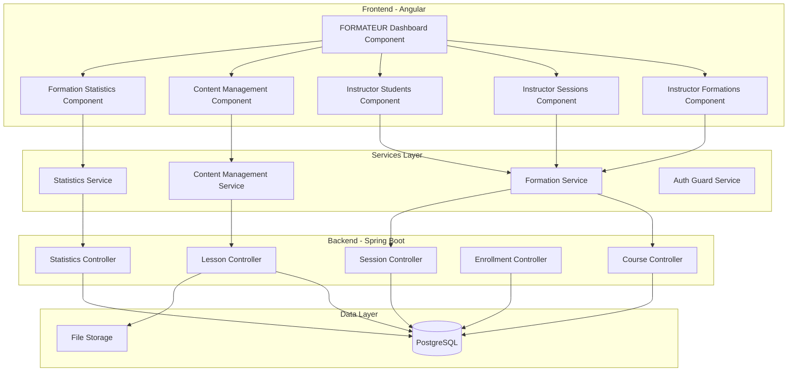
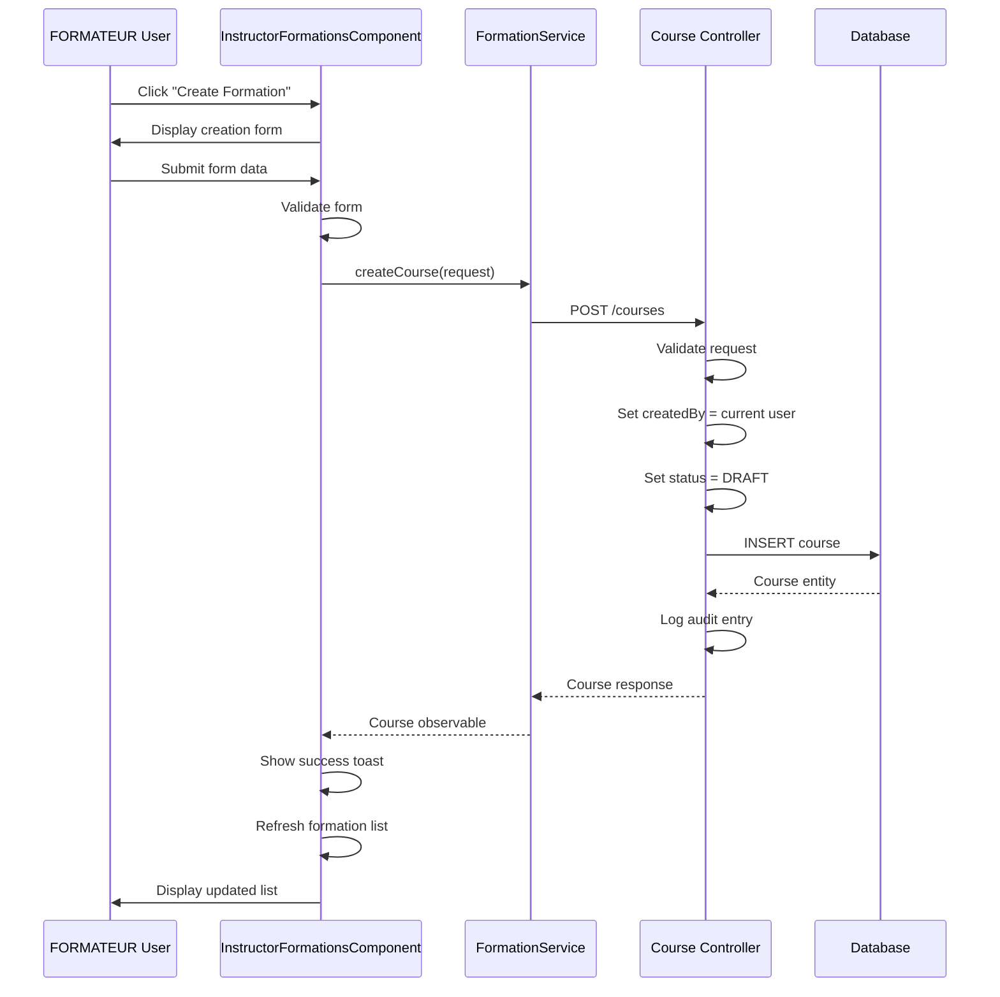
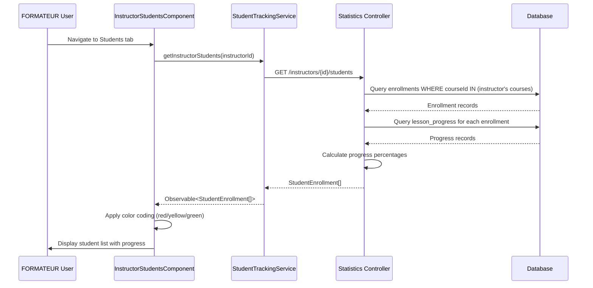
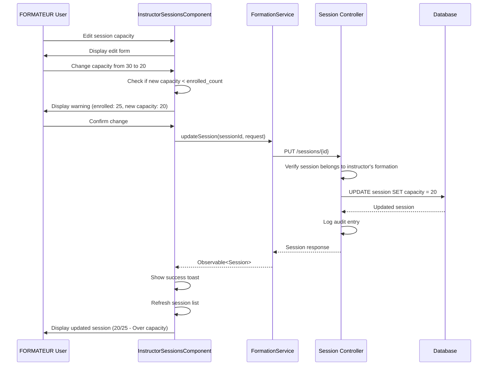

# Design Document: FORMATEUR Management Dashboard

## Overview

The FORMATEUR Management Dashboard is a comprehensive instructor-facing system that enables content creators to manage their educational offerings, track student progress, and organize teaching activities. This design leverages the existing Angular/Spring Boot architecture while adding new instructor-specific components and API endpoints.

### Design Goals

1. **Role Separation**: Provide a distinct interface for FORMATEUR users that focuses on content creation and student management
2. **Reuse Existing Infrastructure**: Leverage existing entities (Course, Lesson, Session, Enrollment) and services
3. **Authorization Security**: Ensure all operations verify formation ownership before allowing modifications
4. **Responsive Design**: Support desktop, tablet, and mobile devices
5. **Real-time Statistics**: Calculate and display teaching effectiveness metrics

### Key Features

- Formation CRUD operations with ownership validation
- Session scheduling and capacity management
- Student progress tracking and analytics
- Content management system for lessons and resources
- Dashboard statistics and visualizations
- Role-based access control

## Architecture

### System Architecture



### Technology Stack

**Frontend:**
- Angular 17+ (Standalone Components)
- RxJS for reactive programming
- Angular Reactive Forms for validation
- Chart.js for statistics visualization
- Angular CDK for drag-and-drop (lesson reordering)

**Backend:**
- Spring Boot 3.x
- Spring Security for authentication/authorization
- Spring Data JPA for database access
- PostgreSQL database
- File storage service (local or cloud)

**Existing Infrastructure:**
- Authentication system with JWT tokens
- User service with role management (FORMATEUR, APPRENANT, ADMIN)
- Formation service with Course, Session, Lesson, Enrollment entities

## Components and Interfaces

### Frontend Component Structure

```
src/app/features/learning/pages/instructor/
├── instructor-dashboard.component.ts          # Main dashboard with statistics
├── instructor-formations.component.ts         # Formation list and CRUD (ENHANCE)
├── instructor-sessions.component.ts           # Session management (NEW)
├── instructor-students.component.ts           # Student tracking (NEW)
├── content-management.component.ts            # Lesson/resource management (EXISTS)
└── formation-statistics.component.ts          # Detailed statistics (NEW)
```

### Component Responsibilities

#### 1. InstructorDashboardComponent (NEW)

**Purpose**: Main landing page for FORMATEUR users with overview statistics

**Features**:
- Display summary cards: total formations, sessions, students, avg completion rate
- Show recent activity feed
- Display enrollment trends chart (last 6 months)
- Quick actions: Create Formation, Create Session
- Navigation to detailed sections

**Data Requirements**:
- Dashboard statistics (from StatisticsService)
- Recent sessions list
- Recent enrollments list

#### 2. InstructorFormationsComponent (ENHANCE)

**Purpose**: Manage all formations created by the instructor

**Current State**: Basic list view with "Manage Content" button

**Enhancements Needed**:
- Add Create Formation modal with form validation
- Add Edit Formation modal
- Add Delete confirmation dialog
- Add filtering by status (DRAFT/PUBLISHED)
- Add sorting by date, title, enrollment count
- Display formation statistics (lesson count, student count, completion rate)
- Add status badge display
- Add publish/unpublish actions

**Data Requirements**:
- List of formations where createdBy = current user
- Formation statistics (lesson count, enrollment count, completion rate)

#### 3. InstructorSessionsComponent (NEW)

**Purpose**: Manage sessions for instructor's formations

**Features**:
- Display all sessions for instructor's formations
- Group by status (PLANNED, OPEN, CLOSED, CANCELED)
- Create new session with form validation
- Edit existing session
- Delete session with confirmation
- View participants modal
- Display capacity utilization
- Filter by formation, date range, status
- Sort by date, formation, enrollment count

**Data Requirements**:
- List of sessions where courseId IN (instructor's formations)
- Session enrollment counts
- Participant details for each session

#### 4. InstructorStudentsComponent (NEW)

**Purpose**: Track all students enrolled in instructor's formations

**Features**:
- Display all enrollments for instructor's formations
- Show student progress for each enrollment
- Filter by formation, session, enrollment status
- Sort by name, enrollment date, progress percentage
- Display aggregate statistics
- Visual progress indicators (color-coded)
- Export student list as CSV

**Data Requirements**:
- List of enrollments where courseId IN (instructor's formations)
- Progress data for each enrollment
- Student user information

#### 5. ContentManagementComponent (EXISTS - ENHANCE)

**Purpose**: Manage lessons and resources for a specific formation

**Current State**: Full CRUD for lessons and resources

**Enhancements Needed**:
- Add drag-and-drop lesson reordering
- Add file upload for resources (not just URLs)
- Add resource preview functionality
- Add bulk operations (delete multiple resources)
- Improve validation and error handling

**Data Requirements**:
- Lessons for selected formation
- Resources for each lesson
- File upload endpoints

#### 6. FormationStatisticsComponent (NEW)

**Purpose**: Detailed analytics for a specific formation

**Features**:
- Enrollment trends over time (chart)
- Completion rate by lesson (chart)
- Student progress distribution (chart)
- Top performing students
- Average time to completion
- Session attendance rates
- Export statistics as PDF

**Data Requirements**:
- Formation-specific enrollment data
- Lesson completion data
- Session attendance data
- Time-series data for trends

### Service Interfaces

#### FormationService (ENHANCE)

```typescript
interface FormationService {
  // Existing methods
  getCourses(status?: CourseStatus): Observable<Course[]>;
  getCourseById(id: number): Observable<Course>;
  createCourse(request: CourseRequest): Observable<Course>;
  updateCourse(id: number, request: CourseRequest): Observable<Course>;
  deleteCourse(id: number): Observable<void>;
  
  // NEW: Instructor-specific methods
  getInstructorFormations(instructorId: number): Observable<Course[]>;
  getFormationStatistics(courseId: number): Observable<FormationStatistics>;
  publishFormation(courseId: number): Observable<Course>;
  unpublishFormation(courseId: number): Observable<Course>;
}
```

#### SessionService (NEW or ENHANCE FormationService)

```typescript
interface SessionService {
  // Existing in FormationService
  getCourseSessions(courseId: number): Observable<Session[]>;
  createSession(courseId: number, request: SessionRequest): Observable<Session>;
  
  // NEW: Instructor-specific methods
  getInstructorSessions(instructorId: number): Observable<Session[]>;
  updateSession(sessionId: number, request: SessionRequest): Observable<Session>;
  deleteSession(sessionId: number): Observable<void>;
  getSessionParticipants(sessionId: number): Observable<SessionEnrollment[]>;
  exportParticipants(sessionId: number): Observable<Blob>;
}
```

#### StudentTrackingService (NEW)

```typescript
interface StudentTrackingService {
  getInstructorStudents(instructorId: number): Observable<StudentEnrollment[]>;
  getStudentProgress(enrollmentId: number): Observable<StudentProgress>;
  getStudentsByFormation(courseId: number): Observable<StudentEnrollment[]>;
  exportStudentList(instructorId: number): Observable<Blob>;
}

interface StudentEnrollment {
  enrollmentId: number;
  userId: number;
  userName: string;
  userEmail: string;
  courseId: number;
  courseTitle: string;
  sessionId?: number;
  sessionDate?: string;
  enrolledAt: string;
  status: EnrollmentStatus;
  progressPercent: number;
  completedLessons: number;
  totalLessons: number;
}

interface StudentProgress {
  enrollmentId: number;
  totalLessons: number;
  completedLessons: number;
  progressPercent: number;
  lessonProgress: LessonProgressDetail[];
  lastActivityAt?: string;
}

interface LessonProgressDetail {
  lessonId: number;
  lessonTitle: string;
  completed: boolean;
  completedAt?: string;
}
```

#### StatisticsService (NEW)

```typescript
interface StatisticsService {
  getDashboardStatistics(instructorId: number): Observable<DashboardStatistics>;
  getFormationStatistics(courseId: number): Observable<FormationStatistics>;
  getEnrollmentTrends(instructorId: number, months: number): Observable<TrendData[]>;
}

interface DashboardStatistics {
  totalFormations: number;
  totalSessions: number;
  totalStudents: number;
  averageCompletionRate: number;
  topFormations: TopFormation[];
  recentEnrollments: RecentEnrollment[];
}

interface FormationStatistics {
  courseId: number;
  courseTitle: string;
  totalEnrollments: number;
  activeEnrollments: number;
  completedEnrollments: number;
  averageCompletionRate: number;
  averageProgressPercent: number;
  totalSessions: number;
  lessonCompletionRates: LessonCompletionRate[];
}

interface TopFormation {
  courseId: number;
  courseTitle: string;
  enrollmentCount: number;
  completionRate: number;
}

interface TrendData {
  month: string;
  enrollments: number;
  completions: number;
}

interface LessonCompletionRate {
  lessonId: number;
  lessonTitle: string;
  completionRate: number;
}
```

## Data Models

### Existing Entities (Reused)

The system leverages existing database entities:

**Course (Formation)**
```sql
CREATE TABLE courses (
    id BIGSERIAL PRIMARY KEY,
    title VARCHAR(200) NOT NULL,
    description TEXT,
    level VARCHAR(20) NOT NULL,
    access_level VARCHAR(20) NOT NULL,
    language VARCHAR(10) NOT NULL,
    duration_minutes INTEGER,
    thumbnail_url VARCHAR(500),
    status VARCHAR(20) NOT NULL DEFAULT 'DRAFT',
    created_at TIMESTAMP NOT NULL DEFAULT CURRENT_TIMESTAMP,
    created_by BIGINT NOT NULL
);
```

**Session**
```sql
CREATE TABLE sessions (
    id BIGSERIAL PRIMARY KEY,
    course_id BIGINT NOT NULL REFERENCES courses(id) ON DELETE CASCADE,
    start_at TIMESTAMP NOT NULL,
    end_at TIMESTAMP NOT NULL,
    timezone VARCHAR(50) NOT NULL,
    capacity INTEGER NOT NULL,
    enrolled_count INTEGER NOT NULL DEFAULT 0,
    status VARCHAR(20) NOT NULL DEFAULT 'PLANNED'
);
```

**Lesson**
```sql
CREATE TABLE lessons (
    id BIGSERIAL PRIMARY KEY,
    course_id BIGINT NOT NULL REFERENCES courses(id) ON DELETE CASCADE,
    title VARCHAR(200) NOT NULL,
    description TEXT,
    order_index INTEGER NOT NULL,
    duration_minutes INTEGER,
    created_at TIMESTAMP NOT NULL DEFAULT CURRENT_TIMESTAMP
);
```

**Lesson_Resource**
```sql
CREATE TABLE lesson_resources (
    id BIGSERIAL PRIMARY KEY,
    lesson_id BIGINT NOT NULL REFERENCES lessons(id) ON DELETE CASCADE,
    title VARCHAR(200) NOT NULL,
    type VARCHAR(20) NOT NULL,
    url VARCHAR(500) NOT NULL,
    duration_minutes INTEGER,
    file_size_bytes BIGINT,
    order_index INTEGER NOT NULL,
    created_at TIMESTAMP NOT NULL DEFAULT CURRENT_TIMESTAMP
);
```

**Enrollment**
```sql
CREATE TABLE enrollments (
    id BIGSERIAL PRIMARY KEY,
    user_id BIGINT NOT NULL,
    course_id BIGINT NOT NULL REFERENCES courses(id) ON DELETE CASCADE,
    session_id BIGINT REFERENCES sessions(id) ON DELETE SET NULL,
    enrolled_at TIMESTAMP NOT NULL DEFAULT CURRENT_TIMESTAMP,
    status VARCHAR(20) NOT NULL DEFAULT 'ACTIVE',
    completed_at TIMESTAMP,
    UNIQUE(user_id, course_id)
);
```

**Lesson_Progress**
```sql
CREATE TABLE lesson_progress (
    id BIGSERIAL PRIMARY KEY,
    enrollment_id BIGINT NOT NULL REFERENCES enrollments(id) ON DELETE CASCADE,
    lesson_id BIGINT NOT NULL REFERENCES lessons(id) ON DELETE CASCADE,
    completed BOOLEAN NOT NULL DEFAULT FALSE,
    completed_at TIMESTAMP,
    UNIQUE(enrollment_id, lesson_id)
);
```

### New Entities (Optional)

**Audit_Log** (for Requirement 25)
```sql
CREATE TABLE audit_logs (
    id BIGSERIAL PRIMARY KEY,
    user_id BIGINT NOT NULL,
    user_role VARCHAR(20) NOT NULL,
    action VARCHAR(50) NOT NULL,
    entity_type VARCHAR(50) NOT NULL,
    entity_id BIGINT,
    ip_address VARCHAR(45),
    user_agent TEXT,
    success BOOLEAN NOT NULL,
    error_message TEXT,
    created_at TIMESTAMP NOT NULL DEFAULT CURRENT_TIMESTAMP
);

CREATE INDEX idx_audit_logs_user_id ON audit_logs(user_id);
CREATE INDEX idx_audit_logs_created_at ON audit_logs(created_at);
CREATE INDEX idx_audit_logs_action ON audit_logs(action);
```

### Data Flow Diagrams

#### Formation Creation Flow



#### Student Progress Tracking Flow



#### Session Capacity Management Flow




## API Endpoints

### Course Management Endpoints

#### GET /api/formation/instructors/{instructorId}/courses
**Purpose**: Get all formations created by an instructor

**Authorization**: FORMATEUR role, instructorId must match authenticated user

**Response**:
```json
[
  {
    "id": 1,
    "title": "Introduction to Angular",
    "description": "Learn Angular from scratch",
    "level": "BEGINNER",
    "accessLevel": "BASIC",
    "status": "PUBLISHED",
    "thumbnailUrl": "https://...",
    "createdAt": "2024-01-15T10:00:00Z",
    "createdBy": 5,
    "statistics": {
      "lessonCount": 12,
      "enrollmentCount": 45,
      "completionRate": 67.5
    }
  }
]
```

#### POST /api/formation/courses
**Purpose**: Create a new formation

**Authorization**: FORMATEUR role

**Request**:
```json
{
  "title": "Introduction to Angular",
  "description": "Learn Angular from scratch",
  "level": "BEGINNER",
  "language": "fr",
  "durationMinutes": 600,
  "thumbnailUrl": "https://...",
  "createdBy": 5
}
```

**Validation**:
- title: required, max 200 characters
- description: required, max 2000 characters
- level: required, must be BEGINNER/INTERMEDIATE/ADVANCED
- createdBy: must match authenticated user ID

**Response**: 201 Created with Course object

#### PUT /api/formation/courses/{courseId}
**Purpose**: Update an existing formation

**Authorization**: FORMATEUR role, must be course creator

**Request**: Same as POST

**Validation**:
- Verify authenticated user is course creator
- If changing status to PUBLISHED, verify at least one lesson exists

**Response**: 200 OK with updated Course object

#### DELETE /api/formation/courses/{courseId}
**Purpose**: Delete a formation

**Authorization**: FORMATEUR role, must be course creator

**Validation**:
- Verify authenticated user is course creator
- Cascade delete: lessons, resources, sessions, enrollments

**Response**: 204 No Content

#### POST /api/formation/courses/{courseId}/publish
**Purpose**: Publish a formation (change status from DRAFT to PUBLISHED)

**Authorization**: FORMATEUR role, must be course creator

**Validation**:
- Verify authenticated user is course creator
- Verify at least one lesson exists

**Response**: 200 OK with updated Course object

### Session Management Endpoints

#### GET /api/formation/instructors/{instructorId}/sessions
**Purpose**: Get all sessions for instructor's formations

**Authorization**: FORMATEUR role, instructorId must match authenticated user

**Query Parameters**:
- status: optional, filter by session status
- courseId: optional, filter by specific formation
- startDate: optional, filter sessions starting after date
- endDate: optional, filter sessions starting before date

**Response**:
```json
[
  {
    "id": 10,
    "courseId": 1,
    "courseTitle": "Introduction to Angular",
    "startAt": "2024-03-01T09:00:00Z",
    "endAt": "2024-03-01T17:00:00Z",
    "timezone": "Europe/Paris",
    "capacity": 30,
    "enrolledCount": 25,
    "status": "OPEN"
  }
]
```

#### POST /api/formation/courses/{courseId}/sessions
**Purpose**: Create a new session for a formation

**Authorization**: FORMATEUR role, must be course creator

**Request**:
```json
{
  "startAt": "2024-03-01T09:00:00",
  "endAt": "2024-03-01T17:00:00",
  "timezone": "Europe/Paris",
  "capacity": 30
}
```

**Validation**:
- Verify authenticated user is course creator
- startAt must not be in the past
- endAt must be after startAt
- capacity must be between 1 and 1000

**Response**: 201 Created with Session object

#### PUT /api/formation/sessions/{sessionId}
**Purpose**: Update an existing session

**Authorization**: FORMATEUR role, must be course creator

**Request**: Same as POST

**Validation**:
- Verify session belongs to instructor's formation
- If reducing capacity below enrolledCount, allow but log warning

**Response**: 200 OK with updated Session object

#### DELETE /api/formation/sessions/{sessionId}
**Purpose**: Delete a session

**Authorization**: FORMATEUR role, must be course creator

**Validation**:
- Verify session belongs to instructor's formation
- Cascade delete enrollments

**Response**: 204 No Content

#### GET /api/formation/sessions/{sessionId}/participants
**Purpose**: Get list of students enrolled in a session

**Authorization**: FORMATEUR role, must be course creator

**Response**:
```json
[
  {
    "enrollmentId": 100,
    "userId": 20,
    "userName": "Jean Dupont",
    "userEmail": "jean@example.com",
    "enrolledAt": "2024-02-15T14:30:00Z",
    "status": "ACTIVE"
  }
]
```

#### GET /api/formation/sessions/{sessionId}/participants/export
**Purpose**: Export participant list as CSV

**Authorization**: FORMATEUR role, must be course creator

**Response**: CSV file download

### Student Tracking Endpoints

#### GET /api/formation/instructors/{instructorId}/students
**Purpose**: Get all students enrolled in instructor's formations

**Authorization**: FORMATEUR role, instructorId must match authenticated user

**Query Parameters**:
- courseId: optional, filter by specific formation
- sessionId: optional, filter by specific session
- status: optional, filter by enrollment status
- minProgress: optional, filter by minimum progress percentage
- maxProgress: optional, filter by maximum progress percentage

**Response**:
```json
[
  {
    "enrollmentId": 100,
    "userId": 20,
    "userName": "Jean Dupont",
    "userEmail": "jean@example.com",
    "courseId": 1,
    "courseTitle": "Introduction to Angular",
    "sessionId": 10,
    "sessionDate": "2024-03-01",
    "enrolledAt": "2024-02-15T14:30:00Z",
    "status": "ACTIVE",
    "progressPercent": 45.5,
    "completedLessons": 5,
    "totalLessons": 11,
    "lastActivityAt": "2024-02-20T10:15:00Z"
  }
]
```

#### GET /api/formation/enrollments/{enrollmentId}/progress
**Purpose**: Get detailed progress for a specific enrollment

**Authorization**: FORMATEUR role, enrollment must be for instructor's formation

**Response**:
```json
{
  "enrollmentId": 100,
  "totalLessons": 11,
  "completedLessons": 5,
  "progressPercent": 45.5,
  "lessonProgress": [
    {
      "lessonId": 1,
      "lessonTitle": "Getting Started",
      "orderIndex": 0,
      "completed": true,
      "completedAt": "2024-02-16T11:00:00Z"
    },
    {
      "lessonId": 2,
      "lessonTitle": "Components",
      "orderIndex": 1,
      "completed": true,
      "completedAt": "2024-02-17T14:30:00Z"
    }
  ],
  "lastActivityAt": "2024-02-20T10:15:00Z"
}
```

### Statistics Endpoints

#### GET /api/formation/instructors/{instructorId}/statistics/dashboard
**Purpose**: Get dashboard overview statistics

**Authorization**: FORMATEUR role, instructorId must match authenticated user

**Response**:
```json
{
  "totalFormations": 5,
  "totalSessions": 12,
  "totalStudents": 145,
  "averageCompletionRate": 68.5,
  "topFormations": [
    {
      "courseId": 1,
      "courseTitle": "Introduction to Angular",
      "enrollmentCount": 45,
      "completionRate": 72.3
    }
  ],
  "recentEnrollments": [
    {
      "enrollmentId": 200,
      "userName": "Marie Martin",
      "courseTitle": "Advanced TypeScript",
      "enrolledAt": "2024-02-25T09:00:00Z"
    }
  ]
}
```

#### GET /api/formation/courses/{courseId}/statistics
**Purpose**: Get detailed statistics for a specific formation

**Authorization**: FORMATEUR role, must be course creator

**Response**:
```json
{
  "courseId": 1,
  "courseTitle": "Introduction to Angular",
  "totalEnrollments": 45,
  "activeEnrollments": 30,
  "completedEnrollments": 15,
  "averageCompletionRate": 72.3,
  "averageProgressPercent": 58.7,
  "totalSessions": 3,
  "lessonCompletionRates": [
    {
      "lessonId": 1,
      "lessonTitle": "Getting Started",
      "completionRate": 95.5
    },
    {
      "lessonId": 2,
      "lessonTitle": "Components",
      "completionRate": 88.9
    }
  ]
}
```

#### GET /api/formation/instructors/{instructorId}/statistics/trends
**Purpose**: Get enrollment trends over time

**Authorization**: FORMATEUR role, instructorId must match authenticated user

**Query Parameters**:
- months: number of months to include (default: 6)

**Response**:
```json
[
  {
    "month": "2024-01",
    "enrollments": 25,
    "completions": 10
  },
  {
    "month": "2024-02",
    "enrollments": 30,
    "completions": 15
  }
]
```

### Content Management Endpoints (Existing - Enhanced)

#### POST /api/formation/lessons/{lessonId}/resources/upload
**Purpose**: Upload a file resource (video, PDF, document)

**Authorization**: FORMATEUR role, must be course creator

**Request**: multipart/form-data
- file: binary file data
- title: string
- type: VIDEO | PDF | DOCUMENT

**Validation**:
- Video files: max 500MB, formats: MP4, WebM
- Document files: max 50MB, formats: PDF, DOCX, PPTX
- Verify lesson belongs to instructor's formation

**Response**:
```json
{
  "id": 50,
  "lessonId": 5,
  "title": "Introduction Video",
  "type": "VIDEO",
  "url": "https://storage.../video.mp4",
  "fileSizeBytes": 45000000,
  "durationMinutes": 15
}
```

#### PUT /api/formation/courses/{courseId}/lessons/reorder
**Purpose**: Reorder lessons within a formation

**Authorization**: FORMATEUR role, must be course creator

**Request**:
```json
{
  "lessonIds": [3, 1, 2, 5, 4]
}
```

**Validation**:
- All lessonIds must belong to the specified course
- Array must contain all lessons for the course

**Response**: 200 OK

### Authorization Middleware

All endpoints must implement the following authorization checks:

1. **Authentication**: Verify JWT token is valid
2. **Role Check**: Verify user has FORMATEUR role
3. **Ownership Verification**: 
   - For course operations: verify createdBy = authenticated user ID
   - For session operations: verify session.courseId belongs to authenticated user
   - For lesson operations: verify lesson.courseId belongs to authenticated user
   - For enrollment operations: verify enrollment.courseId belongs to authenticated user

**Authorization Failure Responses**:
- 401 Unauthorized: Invalid or missing token
- 403 Forbidden: Valid token but insufficient permissions
- 404 Not Found: Resource doesn't exist or user doesn't have access


## Correctness Properties

A property is a characteristic or behavior that should hold true across all valid executions of a system-essentially, a formal statement about what the system should do. Properties serve as the bridge between human-readable specifications and machine-verifiable correctness guarantees.

### Property 1: Formation Ownership Verification

For any formation modification operation (update or delete), the system SHALL verify that the authenticated user is the creator before allowing the operation.

**Validates: Requirements 4.2, 4.7, 5.3, 5.7**

### Property 2: Formation Creation Sets Draft Status

For any newly created formation, the system SHALL set the status to DRAFT by default.

**Validates: Requirements 3.4, 19.1**

### Property 3: Publish Requires Lessons

For any formation being published, the system SHALL verify that at least one lesson exists before allowing the status change to PUBLISHED.

**Validates: Requirements 4.4, 19.3**

### Property 4: Session Ownership Verification

For any session modification operation (update or delete), the system SHALL verify that the session belongs to a formation created by the authenticated user.

**Validates: Requirements 9.2, 9.7, 10.3, 10.6**

### Property 5: Session Date Validation

For any new session creation, the system SHALL validate that the start date is not in the past.

**Validates: Requirements 8.3**

### Property 6: Session Capacity Bounds

For any session, the capacity SHALL be a positive integer between 1 and 1000.

**Validates: Requirements 8.4, 20.1**

### Property 7: Enrollment Count Accuracy

For any session, the enrolled count SHALL equal the number of active enrollments for that session.

**Validates: Requirements 20.2**

### Property 8: Capacity Enforcement

For any session where enrolled count equals capacity, the system SHALL prevent new enrollments.

**Validates: Requirements 20.4**


### Property 9: Progress Calculation Accuracy

For any enrollment, the progress percentage SHALL equal (completed lessons / total lessons) × 100.

**Validates: Requirements 13.2**

### Property 10: Lesson Order Consistency

For any formation, the lesson order indices SHALL be unique and have no gaps (consecutive integers starting from 0).

**Validates: Requirements 18.7**

### Property 11: Resource File Type Validation

For any uploaded resource, the system SHALL validate that video files are MP4 or WebM, and document files are PDF, DOCX, or PPTX.

**Validates: Requirements 17.1**

### Property 12: Resource File Size Validation

For any uploaded resource, the system SHALL validate that video files are max 500MB and document files are max 50MB.

**Validates: Requirements 17.2**

### Property 13: Role-Based Access Control

For any FORMATEUR endpoint request, the system SHALL verify that the authenticated user has FORMATEUR role before processing.

**Validates: Requirements 16.1, 16.3**

### Property 14: Audit Logging Completeness

For any formation, session, lesson, or resource create/update/delete operation, the system SHALL log an audit entry with timestamp and user ID.

**Validates: Requirements 25.1, 25.2, 25.3**

### Property 15: Cascade Delete Formations

For any formation deletion, the system SHALL delete all associated lessons, resources, sessions, and enrollments.

**Validates: Requirements 5.4, 5.5**


### Property 16: Cascade Delete Sessions

For any session deletion, the system SHALL delete all associated enrollments.

**Validates: Requirements 10.4**

### Property 17: Input Validation Consistency

For any user input, the system SHALL validate on both frontend and backend to ensure data integrity.

**Validates: Requirements 22.1, 22.2, 22.3, 22.4, 22.5**

### Property 18: XSS Prevention

For any text input, the system SHALL sanitize the content to prevent XSS attacks.

**Validates: Requirements 22.7**

### Property 19: Statistics Calculation Accuracy

For any instructor dashboard statistics, the total students SHALL equal the count of unique users enrolled in the instructor's formations.

**Validates: Requirements 14.3**

### Property 20: Formation Visibility Control

For any formation with status DRAFT, the system SHALL hide it from student course browsing.

**Validates: Requirements 19.2**

### Property 21: Published Formation Visibility

For any formation with status PUBLISHED, the system SHALL make it visible in student course browsing.

**Validates: Requirements 19.4**

### Property 22: Lesson Reordering Preserves Content

For any lesson reordering operation, the system SHALL preserve all lesson content and only modify order indices.

**Validates: Requirements 18.6**


### Property 23: Filter Application Correctness

For any filtered list (formations, sessions, students), the system SHALL return only items matching all applied filter criteria.

**Validates: Requirements 2.4, 7.4, 12.3, 24.2, 24.4, 24.5**

### Property 24: Search Functionality Correctness

For any search query, the system SHALL return items where the search term appears in the specified fields (case-insensitive).

**Validates: Requirements 24.1, 24.3, 24.5**

### Property 25: Pagination Consistency

For any paginated list, the system SHALL return the correct page of results with no duplicates or missing items across pages.

**Validates: Requirements 23.2, 23.3, 23.4**

## Error Handling

### Frontend Error Handling

**Form Validation Errors**:
- Display inline error messages next to invalid fields
- Prevent form submission until all validation passes
- Show field-specific error messages (e.g., "Title must be less than 200 characters")

**API Error Responses**:
- 400 Bad Request: Display validation error messages from server
- 401 Unauthorized: Redirect to login page with session timeout message
- 403 Forbidden: Display "You don't have permission to perform this action"
- 404 Not Found: Display "Resource not found" message
- 500 Internal Server Error: Display "An error occurred. Please try again later"

**Network Errors**:
- Connection timeout: Display "Connection timeout. Please check your internet connection"
- Network unavailable: Disable form submissions and show warning banner
- Retry mechanism: Provide "Retry" button for failed operations

**Success Notifications**:
- Formation created: "Formation created successfully"
- Formation updated: "Formation updated successfully"
- Formation deleted: "Formation deleted successfully"
- Session created: "Session created successfully"
- Lesson created: "Lesson added successfully"
- Resource uploaded: "Resource uploaded successfully"


### Backend Error Handling

**Validation Errors**:
- Return 400 Bad Request with detailed error messages
- Include field names and specific validation failures
- Example: `{"field": "title", "message": "Title must not exceed 200 characters"}`

**Authorization Errors**:
- Return 401 Unauthorized for invalid/missing tokens
- Return 403 Forbidden for insufficient permissions
- Log all authorization failures for security auditing

**Business Logic Errors**:
- Formation publish without lessons: 400 Bad Request with message "Cannot publish formation without lessons"
- Session capacity below enrollment count: Allow but log warning
- Duplicate enrollment: 409 Conflict with message "User already enrolled"

**Database Errors**:
- Constraint violations: Return 400 Bad Request with user-friendly message
- Foreign key violations: Return 400 Bad Request with message "Referenced resource not found"
- Connection errors: Return 503 Service Unavailable with retry-after header

**File Upload Errors**:
- File too large: 413 Payload Too Large with message "File exceeds maximum size"
- Invalid file type: 400 Bad Request with message "File type not supported"
- Storage errors: 500 Internal Server Error with message "Failed to store file"

**Error Logging**:
- Log all errors with stack traces to application logs
- Include request ID for tracing
- Log user ID, action, and timestamp for audit trail
- Separate logs for security events (authorization failures)

## Testing Strategy

### Unit Testing

**Frontend Component Tests**:
- Test component rendering with mock data
- Test form validation logic
- Test user interactions (button clicks, form submissions)
- Test error state handling
- Test loading state handling
- Test empty state handling

**Frontend Service Tests**:
- Test HTTP request construction
- Test response parsing
- Test error handling
- Test observable transformations

**Backend Controller Tests**:
- Test request validation
- Test authorization checks
- Test successful responses
- Test error responses
- Test edge cases (empty lists, null values)

**Backend Service Tests**:
- Test business logic
- Test data transformations
- Test validation rules
- Test error conditions

**Backend Repository Tests**:
- Test database queries
- Test data persistence
- Test cascade deletes
- Test constraint enforcement


### Property-Based Testing

Property-based testing will be implemented using appropriate libraries for each language:
- **Frontend (TypeScript)**: fast-check library
- **Backend (Java)**: jqwik library

**Configuration**:
- Minimum 100 iterations per property test
- Each test tagged with: `Feature: formateur-dashboard-complete, Property {number}: {property_text}`

**Property Test Examples**:

**Property 1: Formation Ownership Verification**
```typescript
// Frontend test
it('should reject formation updates from non-creators', () => {
  fc.assert(
    fc.property(
      fc.record({
        formationId: fc.integer(1, 1000),
        creatorId: fc.integer(1, 100),
        requesterId: fc.integer(1, 100)
      }),
      (data) => {
        // Given a formation and two different users
        fc.pre(data.creatorId !== data.requesterId);
        
        // When non-creator attempts to update
        const result = canUpdateFormation(data.formationId, data.creatorId, data.requesterId);
        
        // Then operation should be rejected
        expect(result).toBe(false);
      }
    ),
    { numRuns: 100 }
  );
});
```

**Property 9: Progress Calculation Accuracy**
```java
// Backend test
@Property
@Label("Feature: formateur-dashboard-complete, Property 9: Progress calculation accuracy")
void progressCalculationIsAccurate(@ForAll @IntRange(min = 1, max = 50) int totalLessons,
                                   @ForAll @IntRange(min = 0, max = 50) int completedLessons) {
    // Given completed lessons <= total lessons
    Assume.that(completedLessons <= totalLessons);
    
    // When calculating progress
    double progress = calculateProgress(completedLessons, totalLessons);
    
    // Then progress should equal (completed / total) * 100
    double expected = (completedLessons * 100.0) / totalLessons;
    assertThat(progress).isCloseTo(expected, within(0.01));
}
```

**Property 11: Resource File Type Validation**
```java
@Property
@Label("Feature: formateur-dashboard-complete, Property 11: Resource file type validation")
void resourceFileTypeValidation(@ForAll("validVideoExtensions") String videoExt,
                                @ForAll("validDocExtensions") String docExt) {
    // Given valid file extensions
    String videoFile = "video" + videoExt;
    String docFile = "document" + docExt;
    
    // When validating file types
    boolean videoValid = isValidResourceFile(videoFile, ResourceType.VIDEO);
    boolean docValid = isValidResourceFile(docFile, ResourceType.DOCUMENT);
    
    // Then validation should pass
    assertThat(videoValid).isTrue();
    assertThat(docValid).isTrue();
}

@Provide
Arbitrary<String> validVideoExtensions() {
    return Arbitraries.of(".mp4", ".webm");
}

@Provide
Arbitrary<String> validDocExtensions() {
    return Arbitraries.of(".pdf", ".docx", ".pptx");
}
```


### Integration Testing

**API Integration Tests**:
- Test complete request/response cycles
- Test authentication and authorization flows
- Test database transactions
- Test file upload and storage
- Test cascade deletes
- Test concurrent operations

**End-to-End Tests**:
- Test complete user workflows
- Test formation creation to publication flow
- Test session creation and enrollment flow
- Test content management workflow
- Test student progress tracking
- Test statistics calculation

**Test Data Management**:
- Use test database with isolated data
- Create test fixtures for common scenarios
- Clean up test data after each test
- Use factories for generating test entities

### Performance Testing

**Load Testing**:
- Test dashboard load with 100+ formations
- Test session list with 500+ sessions
- Test student list with 1000+ enrollments
- Verify pagination performance
- Verify statistics calculation performance

**Response Time Requirements**:
- Dashboard initial load: < 2 seconds
- Formation list load: < 1 second
- Session list load: < 1 second
- Student list load: < 1.5 seconds
- Statistics calculation: < 3 seconds
- File upload (50MB): < 30 seconds

### Security Testing

**Authorization Tests**:
- Verify FORMATEUR role requirement for all endpoints
- Verify ownership checks for all modification operations
- Verify cross-user access prevention
- Test token expiration handling
- Test invalid token handling

**Input Validation Tests**:
- Test SQL injection prevention
- Test XSS prevention
- Test file upload security (malicious files)
- Test path traversal prevention
- Test CSRF protection

**Audit Logging Tests**:
- Verify all operations are logged
- Verify log completeness (user ID, timestamp, action)
- Verify authorization failure logging
- Verify log retention

## Implementation Notes

### Phase 1: Core Infrastructure (Week 1)
- Create new Angular components (InstructorDashboardComponent, InstructorSessionsComponent, InstructorStudentsComponent)
- Create new services (StudentTrackingService, StatisticsService)
- Implement route guards for FORMATEUR role
- Set up component routing

### Phase 2: Formation Management (Week 2)
- Enhance InstructorFormationsComponent with CRUD operations
- Implement formation creation modal with validation
- Implement formation edit modal
- Implement delete confirmation dialog
- Add filtering and sorting
- Implement publish/unpublish actions

### Phase 3: Session Management (Week 3)
- Implement InstructorSessionsComponent
- Create session creation form
- Create session edit form
- Implement participants modal
- Add capacity management
- Implement filtering and sorting


### Phase 4: Student Tracking (Week 4)
- Implement InstructorStudentsComponent
- Create student list with progress indicators
- Implement progress detail view
- Add filtering and sorting
- Implement CSV export functionality
- Add color-coded progress indicators

### Phase 5: Statistics and Analytics (Week 5)
- Implement FormationStatisticsComponent
- Create dashboard statistics cards
- Implement enrollment trends chart
- Implement lesson completion chart
- Add top formations display
- Implement statistics export

### Phase 6: Backend API Endpoints (Week 6)
- Implement instructor-specific endpoints
- Add ownership verification middleware
- Implement statistics calculation services
- Add audit logging
- Implement file upload handling
- Add CSV export endpoints

### Phase 7: Testing and Polish (Week 7)
- Write unit tests for all components
- Write property-based tests for core properties
- Write integration tests for API endpoints
- Perform security testing
- Optimize performance
- Fix bugs and polish UI

### Technical Considerations

**State Management**:
- Use RxJS BehaviorSubjects for shared state
- Implement caching for formation and session lists (5-minute TTL)
- Use Angular signals for reactive UI updates

**File Upload**:
- Implement chunked upload for large files
- Show upload progress indicator
- Validate file type and size on frontend before upload
- Store files in organized directory structure: `/uploads/{courseId}/{lessonId}/{resourceId}.{ext}`

**Performance Optimization**:
- Implement virtual scrolling for long lists
- Use lazy loading for images
- Implement pagination for all lists
- Cache API responses with appropriate TTL
- Use Angular OnPush change detection strategy

**Responsive Design**:
- Use CSS Grid and Flexbox for layouts
- Implement mobile-first design approach
- Use media queries for breakpoints: 768px (tablet), 1024px (desktop)
- Test on multiple devices and screen sizes

**Accessibility**:
- Use semantic HTML elements
- Implement ARIA labels for interactive elements
- Ensure keyboard navigation works
- Maintain sufficient color contrast
- Provide alt text for images

**Browser Compatibility**:
- Support Chrome, Firefox, Safari, Edge (latest 2 versions)
- Use polyfills for older browser features
- Test on multiple browsers

## Security Considerations

### Authentication and Authorization

**Token-Based Authentication**:
- Use JWT tokens for authentication
- Store tokens securely in httpOnly cookies or localStorage
- Implement token refresh mechanism
- Handle token expiration gracefully

**Role-Based Access Control**:
- Verify FORMATEUR role on every request
- Implement ownership checks for all resources
- Use middleware for consistent authorization
- Log all authorization failures

**API Security**:
- Implement rate limiting to prevent abuse
- Use HTTPS for all communications
- Validate all inputs on backend
- Sanitize all outputs to prevent XSS
- Use parameterized queries to prevent SQL injection

### Data Protection

**Sensitive Data**:
- Don't expose user passwords or tokens in logs
- Mask sensitive data in error messages
- Implement proper error handling to avoid information leakage

**File Upload Security**:
- Validate file types using magic numbers, not just extensions
- Scan uploaded files for malware
- Store files outside web root
- Generate unique filenames to prevent overwrites
- Implement file size limits

**Audit Trail**:
- Log all data modifications
- Include user ID, timestamp, action, and IP address
- Store logs securely with restricted access
- Implement log rotation and retention policies

## Deployment Considerations

**Environment Configuration**:
- Use environment variables for configuration
- Separate development, staging, and production configs
- Never commit secrets to version control

**Database Migrations**:
- Create migration scripts for schema changes
- Test migrations on staging before production
- Implement rollback procedures

**Monitoring and Logging**:
- Implement application performance monitoring
- Set up error tracking (e.g., Sentry)
- Monitor API response times
- Track user activity metrics
- Set up alerts for critical errors

**Backup and Recovery**:
- Implement automated database backups
- Store backups in separate location
- Test backup restoration procedures
- Implement file storage backups

## Conclusion

This design provides a comprehensive blueprint for implementing the FORMATEUR Management Dashboard. The system leverages existing infrastructure while adding new instructor-specific features. The design emphasizes security through ownership verification, proper authorization, and audit logging. Performance is addressed through pagination, caching, and lazy loading. The testing strategy includes unit tests, property-based tests, and integration tests to ensure correctness and reliability.

The phased implementation approach allows for incremental development and testing, reducing risk and enabling early feedback. The design is flexible enough to accommodate future enhancements while maintaining a clean architecture and separation of concerns.

